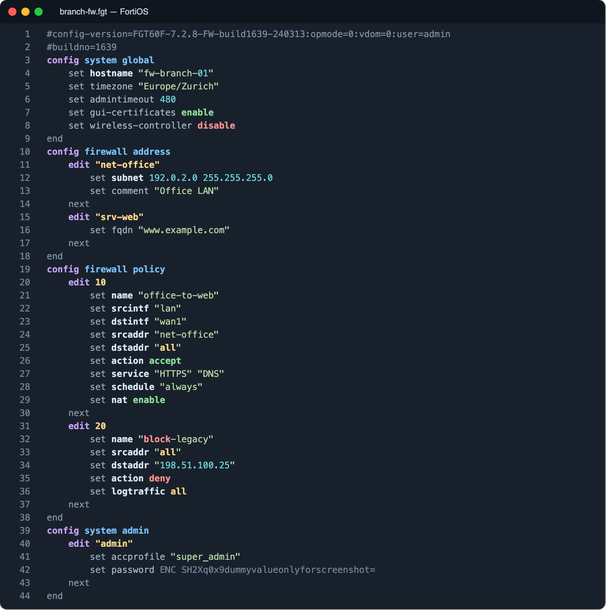
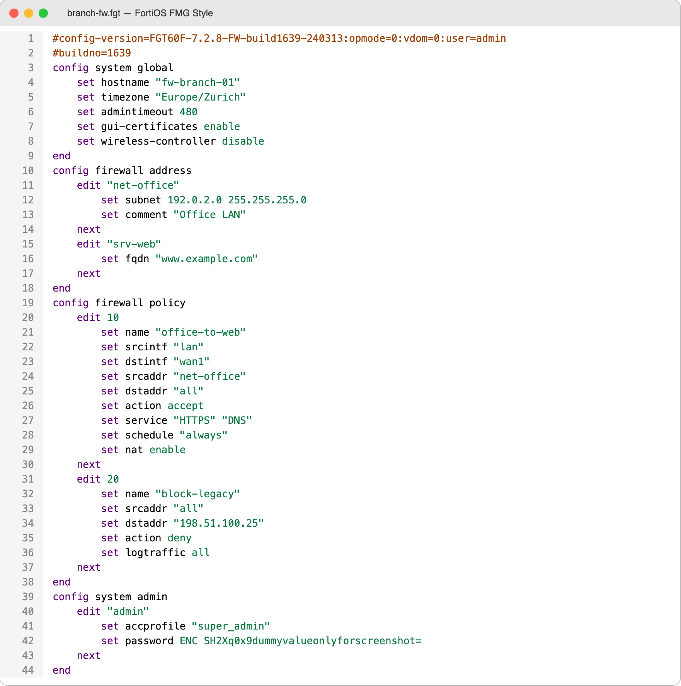

# Sublime Text Extensions

Syntax highlighting and extensions for Sublime Text. Each package lives in its
own project folder with source code, documentation and tests.

| Package | Description |
| --- | --- |
| [FortiGate / FortiOS](FortiGate/README.md) | Syntax highlighting, semantic block folding and navigation for FortiOS configurations |

## Screenshots

**FortiOS** — dark scheme with weighted structure, actions and payloads:



**FortiOS FMG Style** — light four-color scheme modeled on the FortiManager config view:



## Installing FortiOS

Copy the [`FortiGate/FortiOS`](FortiGate/FortiOS) folder as `FortiOS` into Sublime's
package directory (**Preferences → Browse Packages…**).
Then choose **View → Syntax → FortiOS → FortiOS** or **FortiOS FMG Style**, or open an
`.fgt` / `.fortios` file.

Alternatively, build an installable archive:

```sh
python3 FortiGate/tools/build_package.py
```

Copy the resulting `FortiGate/dist/FortiOS.sublime-package` into `Installed Packages`.
[Full guide and folding commands](FortiGate/README.md).

## Tests

```sh
python3 -m unittest discover -s FortiGate/tests -v
```

Original device backups do not belong in this repository.
